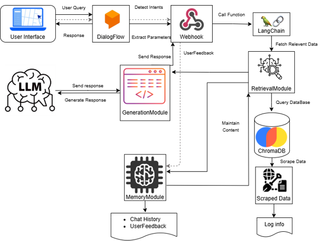
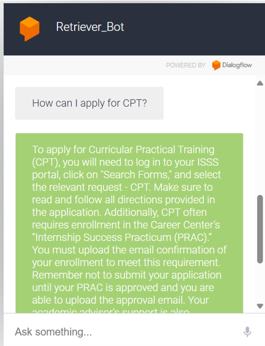
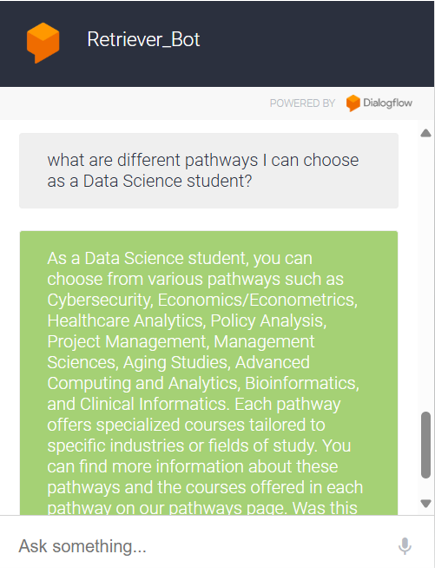
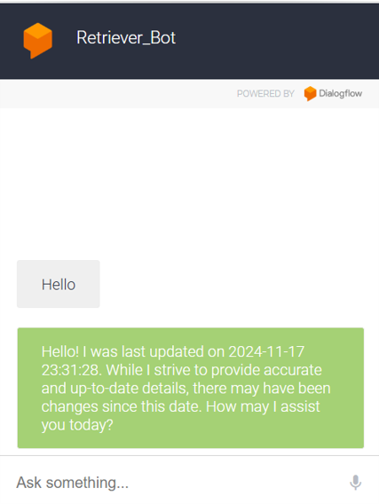

# UMBC Data Science Chatbot

## Table of Contents
1. [Overview](#overview)
2. [Research Questions](#research-questions)
3. [Features](#features)
4. [System Architecture](#system-architecture)
5. [Implementation](#implementation)
6. [Project Directory](#project-directory)
7. [Requirements](#requirements)
8. [Getting Started](#getting-started)
   - [Quick Launch](#quick-launch)
   - [Colab Demos](#colab-demos)
   - [Advanced Setup](#advanced-setup)
9. [Workflow](#workflow)
10. [Logging](#logging)
11. [Future Improvements](#future-improvements)
12. [Sample Outputs](#sample-outputs)

---

## Overview

UMBC Data Science Chatbot is an AI-driven assistant developed for UMBC students in the Data Science program. It helps users retrieve critical academic information such as:

- 📘 Course-related details
- 🧑‍🔬 Faculty research areas
- 💬 General program inquiries

The chatbot integrates Dialogflow for natural language intent recognition, OpenAI's GPT-3.5-turbo for response generation, LangChain for contextual memory, and Chroma for efficient vector search.

## Research Questions

This project addresses the following:

1. 🎯 How effectively can the chatbot assist students in locating relevant academic information?
2. 🌎 Can it help international students understand CPT/OPT processes better?
3. ✅ How accurately does it respond to diverse inquiries using live data from UMBC Data Science resources?

## Features

### Key Capabilities

- 🤖 Intent recognition with Dialogflow
- 🔍 Contextual retrieval using LangChain
- 💬 Feedback integration for learning and improvement
- 🧠 Metadata filtering for precise answers
- 🔄 Auto-updated knowledge base via web scraping

### Deployment & CI/CD

- 🐳 Dockerized environment for consistent deployment
- 🚀 GitHub Actions for automated builds and deployment

## System Architecture



### Components

- **Dialogflow**: Understands intents and manages conversation flow
- **LangChain**: Maintains memory and retrieves contextually relevant information
- **GPT-3.5-turbo**: Generates human-like responses
- **Chroma**: Stores and retrieves embeddings for fast lookup
- **Selenium**: Automates web scraping from the UMBC site
- **GitHub Actions**: Automates Docker builds and deployment

## Implementation

- **Dialogflow**: Custom intents for academic and administrative tasks
- **LangChain**: Manages memory and fetches embeddings
- **Chroma**: Uses OpenAI’s Ada model for vector representations
- **Selenium**: Scrapes data from `dil.umbc.edu` to stay updated

## Project Directory

```plaintext
UMBCDataScienceChatbot/
├── .github/workflows/
│   └── docker-build.yml
├── assets/
├── data/
├── embeddings.py
├── feedback.py
├── intent_handler.py
├── main.py
├── prompts.py
├── query_handler.py
├── scraping.py
├── Dockerfile
├── requirements.txt
├── README.md
├── .env.example
├── .dockerignore
├── .gitignore
```

## Requirements

Make sure you have:

- Python 3.13
- Docker
- Git
- OpenAI API Key
- A configured Dialogflow Agent

## Getting Started

### 🌐 Colab Demos

Explore functionalities via interactive notebooks:

- [Web Scraping](https://drive.google.com/file/d/1i1SXSxEjtGyuHH3garqGlijxhPrOZkU_/view?usp=sharing)
- [Chatbot Interaction](https://colab.research.google.com/drive/1IgwI92aAHWaNaYtQUwxhrqZUbuWscBHB?usp=sharing)

### Quick Launch

1. Clone the repository:
```bash
git clone https://github.com/yourusername/umbc-data-science-chatbot.git
```

2. Change directory:
```bash
cd umbc-data-science-chatbot
```

3. Set up virtual environment:
```bash
python -m venv venv
source venv/bin/activate  # On Windows: venv\Scripts\activate
```

4. Install dependencies:
```bash
pip install -r requirements.txt
```

5. Expose with Ngrok:
```bash
ngrok http 5000
```

6. Set webhook in Dialogflow to your Ngrok URL.

7. Run the chatbot:
```bash
python main.py
```

### Sample Questions

- "What is the CPT application process?"
- "Tell me about DATA 604 course outcomes."
- "Who is researching Natural Language Processing?"

### Advanced Setup

#### 🐳 Docker Deployment

1. Create a Docker Hub account
2. Set GitHub repository secrets:
   - `DOCKER_USERNAME`
   - `DOCKER_REPO`
   - `DOCKER_ACCESS_TOKEN`

3. Use GitHub Actions for CI/CD Docker builds

4. Pull and run the image:
```bash
docker pull yourusername/umbc-data-science-chatbot:latest
docker run -e OPENAI_API_KEY='<your_key>' -p 8080:5000 umbc-data-science-chatbot
```

## Workflow

- Scraper updates data monthly
- CI/CD deploys new images if updates are detected

## Logging

Scraping activity is tracked in `scrape_log.log`.

## Future Improvements

### Cloud Hosting

- Deploy on platforms like GCP, Heroku, or AWS for stable webhooks

### Enhanced CI/CD

- Automate full deployment pipeline via GitHub Actions

### Session Management

- Multi-user support with persistent session context

### Feedback-Based Training

- Incorporate user feedback for response accuracy improvements

### Database Integration

- Store history, preferences, and feedback for advanced analytics

### Caching

- Add Redis or similar caching for repeated queries

## Sample Outputs

- **CPT Info**  
  

- **Program Pathways**  
  

- **Bot Welcome Message**  
  

---

We welcome contributions! Open issues or submit PRs to help improve the UMBC Data Science Chatbot.
